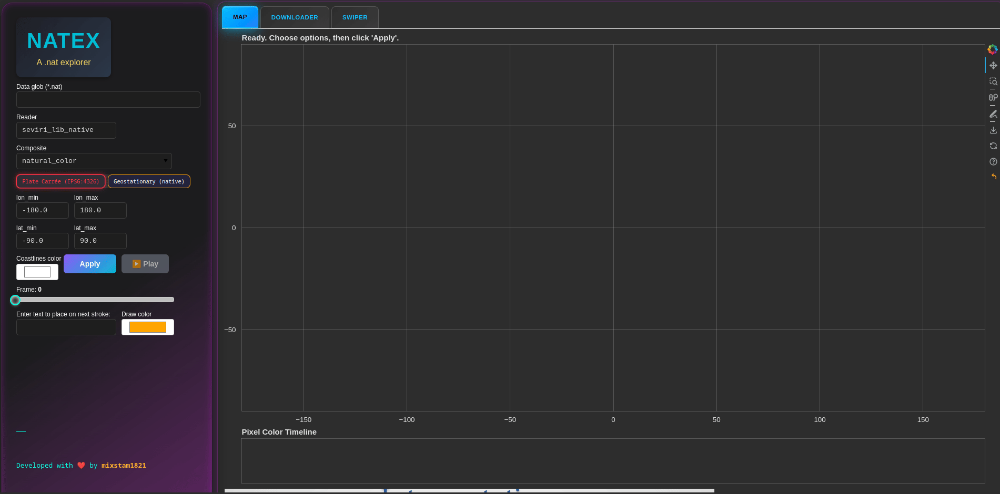
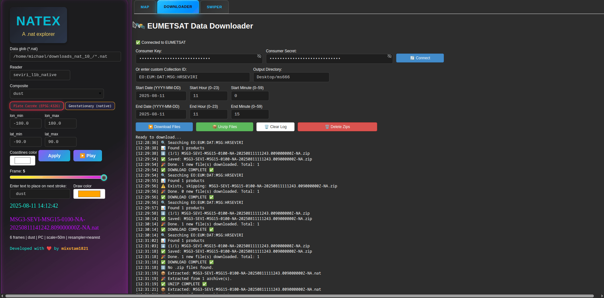

# NATEX — a simple `.nat` files explorer

**NATEX** is a quick viewer for EUMETSAT `.nat` files built in **Python** with **Satpy** and **Bokeh**.  
It loads time-sorted frames, applies Satpy composites, overlays coastlines/borders, and lets you animate, probe pixel colors, and compare PNGs with a swipe tool. It also includes a simple **EUMETSAT downloader** tab.

## ✨ Features
- 🗺 Interactive Map Viewer. View satellite composites in Plate Carrée or Geostationary projection.
- Load `.nat` files via glob pattern
- 🌈 Multiple Composites Support for dozens of predefined composites (e.g., airmass, natural_color, dust, day_microphysics, and more).
- Plate Carrée **or** native geostationary view
- Coastlines & country borders with custom color.
- Smooth zoom & pan with WebGL rendering.
- Frame slider + play/pause animation
- 📊 Pixel Color Time Series Click any pixel in the image to see how its color changes across the loaded frames.
- 🖌 Freehand Drawing & Annotations Draw directly on the map, add custom text labels, and color your annotations. Includes Undo support with a custom toolbar icon.
- 📡 EUMETSAT Downloader Connect to the EUMETSAT Data Store, search datasets by date/time range, and download .nat files directly.
- 📦 File Management Built-in unzipper and zip cleaner.
- 🔄 Image Swipe Viewer Compare two different PNG images interactively with a draggable swipe handle.

---

1) Load your path either with a single .nat file or multiple by adding *.nat at the end (e.g. /home/michael/nats/*nat))
2) Select your Composite (and/or Reader if necessary), your area (lat, lon) and the projection (Plate Carree or Geostationary).
3) Click *Apply*. The files will be loading. It takes some time...
   


4) You can zoom in/out, pan and animate either with play button or the slider.


5) Users can change the color of the coastlines and the custom draws.


6) Users can draw on the plot. Click on the pen which is in the toolbar on the right of the plot. Then on the left, under the slider, type the text you want to display on the draw, and go to the map drawing for example a circle around a dust plume. You can erase the draws with the 'erase' button on the toolbar (the last one). To deactivate the pen, click again on the pen (to not be with blue mark). You can choose pan and wheel zoom to continue the exploration.


7) Add your credentials to download the files for the date of interest. Download, Unzip (keeps inly the .nat files) and/or remove the zip files at the end. The folder will be defined by the user in the home dir.


8) Finally, there is a swiper module to load the local .png and compare them. Please note, that in the folder where you downloaded the .nat files, after their loading in NATEX, the corresponding .png images will be saved in the same dir.


## 🧰 Set Up


```bash
# 1) Clone the repo

git clone https://github.com/mixstam1821/NATEX.git
cd NATEX

# 2) (Recommended) Create & activate a virtual env
python -m venv .venv
# macOS/Linux:
source .venv/bin/activate
# Windows (PowerShell):
# .\.venv\Scripts\Activate.ps1

# 3) Install dependencies
pip install -U pip
pip install -r requirements.txt

# 4) Run the Bokeh app (adjust the path to your file)
bokeh serve --show NATEX.py
```

OR

Docker

```bash
# 1) Clone the repo

git clone https://github.com/mixstam1821/NATEX.git
cd NATEX

# 2) Build the image
docker build -t natex .

# 3) Run the container
docker run -it --rm -p 5006:5006 natex

# 4) Visit : http://localhost:5006/NATEX
 
```

📜 License
MIT License — feel free to use, modify, and share.
